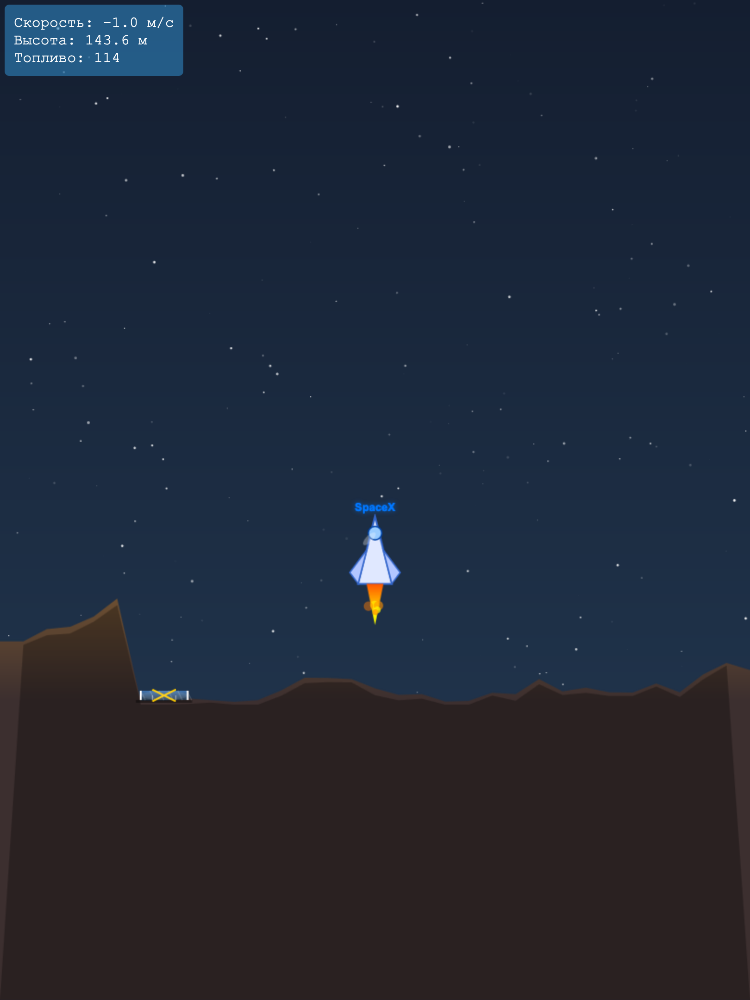

# SpaceX Starship Lander

Игра-симулятор посадки космического корабля SpaceX Starship на поверхность. Цель — успешно посадить корабль на обозначенную площадку со скоростью менее 2 м/с, используя ограниченное количество топлива (200 единиц).

## Описание
В этой игре вы управляете космическим кораблем SpaceX Starship, чтобы совершить мягкую посадку на случайно сгенерированную поверхность. Игра включает реалистичную физику (гравитация, тяга, инерция) и адаптивный интерфейс для мобильных устройств.

### Особенности:
- Реалистичная физика посадки.
- Адаптивный дизайн для ПК и мобильных устройств.
- Ограниченное топливо (200 единиц).
- Случайно генерируемый рельеф с уменьшенной посадочной площадкой.
- Визуальные эффекты (огонь двигателя, звезды, детализированная площадка).

## Управление
- **↑**: Тяга вверх (увеличивает подъемную силу).
- **←**: Маневр влево.
- **→**: Маневр вправо.
- На мобильных устройствах: используйте кнопки на экране (←, ↑, →).

## Установка
1. Склонируйте репозиторий:
   ```bash
   git clone https://github.com/ваш-username/game-space-x-lander.git
   ```
2. Перейдите в папку проекта:
   ```bash
   cd game-space-x-lander
   ```
3. Откройте файл `index.html` в современном браузере (Chrome, Firefox, Edge и т.д.).

## Использование
- Откройте игру в браузере.
- Нажмите кнопку **"ЗАПУСК"**, чтобы начать.
- Управляйте кораблем с помощью клавиш или сенсорных кнопок (на мобильных устройствах).
- Постарайтесь посадить корабль на площадку со скоростью менее 2 м/с.
- После завершения игры нажмите **"Новая игра"**, чтобы начать заново.

## Требования
- Современный веб-браузер с поддержкой HTML5 и JavaScript (Google Chrome, Mozilla Firefox, Microsoft Edge и т.д.).
- Для мобильных устройств: сенсорный экран и браузер с поддержкой touch-событий.

## Структура проекта
```
game-space-x-lander/
    ├── .gitignore
    ├── index.html
    ├── styles.css
    ├── script.js
    ├── README.md
```

## Деплой на GitHub Pages (опционально)
1. Загрузите проект в репозиторий на GitHub.
2. Перейдите в настройки репозитория → **Pages**.
3. Выберите ветку `main` и папку `/root`.
4. После публикации игра будет доступна по адресу: `https://ваш-username.github.io/game-space-x-lander/`.

## Скриншоты

```
